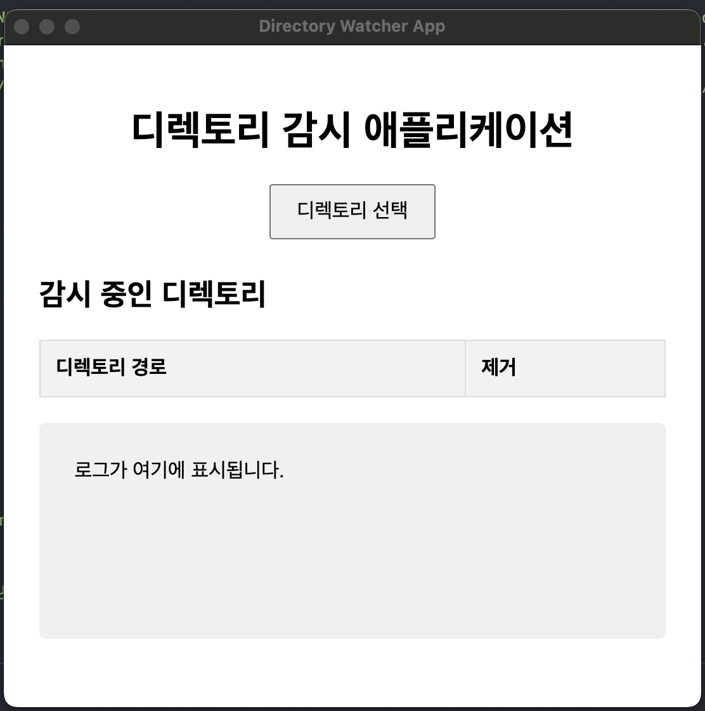
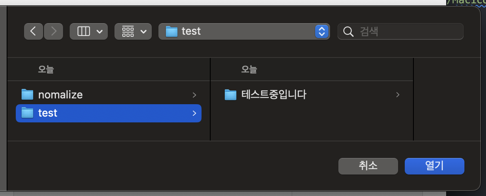

# NFD to NFC Normalizer

이 애플리케이션은 백그라운드에서 선택한 디렉토리를 감시하고, NFD로 인코딩된 파일 이름을 자동으로 NFC 인코딩으로 변환합니다.

Nomalize는 macOS 용 애플리케이션과 Node.js 패키지로 제공됩니다. macOS 앱은 `MACOS-APP`에서 빌드 가능하며, Node.js 패키지는 `nfd2nfc`에서 빌드 가능하고 다음 명령어로 설치할 수 있습니다:

```bash
npm install @pieroot/nfd2nfc
```

## 설치

### macOS 애플리케이션

`MACOS-APP` 디렉토리에서 빌드하여 설치하거나 [릴리즈 페이지]()에서 다운로드합니다.

### Node.js 패키지

npm을 통해 패키지를 설치합니다:

```bash
# 지역적으로 설치
npm install @pieroot/nfd2nfc

# 글로벌로 설치
npm install -g @pieroot/nfd2nfc
```

## 사용법

### macOS 애플리케이션

애플리케이션을 실행하여 원하는 기능을 사용합니다.


디렉토리 선택 버튼을 클릭하여 디렉토리를 선택합니다.


감시할 디렉토리를 선택합니다.

### CLI

CLI를 사용하여 변환할 문자열을 입력합니다:

```bash
nfd2nfc [options] <path>

# 옵션
nfd2nfc -h # 도움말
nfd2nfc -v # verbose 모드
```

### Node.js 패키지

패키지를 불러와서 사용합니다:

```javascript
const nfd2nfc = require("@pieroot/nfd2nfc");

let str_nfc = nfd2nfc.normalizeToNFC("NFD로 인코딩된 문자열");
let str_nfd = nfd2nfc.normalizeToNFD("NFC로 인코딩된 문자열");
```

## 빌드 방법

- macOS 애플리케이션은 `MACOS-APP`에서 빌드할 수 있습니다.

  ```bash
  cd MACOS-APP
  npm install
  npm run build
  ```

- Node.js 패키지는 `nfd2nfc`에서 빌드 가능하며, 다음 명령어로 설치할 수 있습니다:

  ```bash
    cd nfd2nfc
    npm install
    npm run build
  ```

## 기여

이 프로젝트에 기여하려면 다음 단계를 따르세요:

1. 이 저장소를 포크합니다.
2. 새로운 브랜치를 만듭니다: `git checkout -b feat/new-feature`
3. 변경 사항을 커밋합니다: `git commit -am 'Add new feature'`
4. 브랜치에 푸시합니다: `git push origin feat/new-feature`
5. PR을 만듭니다.

## 라이선스

이 프로젝트는 MIT 라이선스를 사용합니다.
