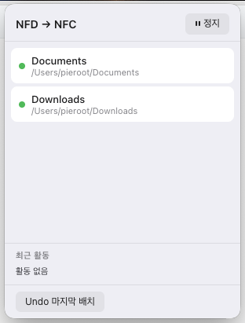
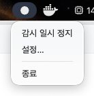
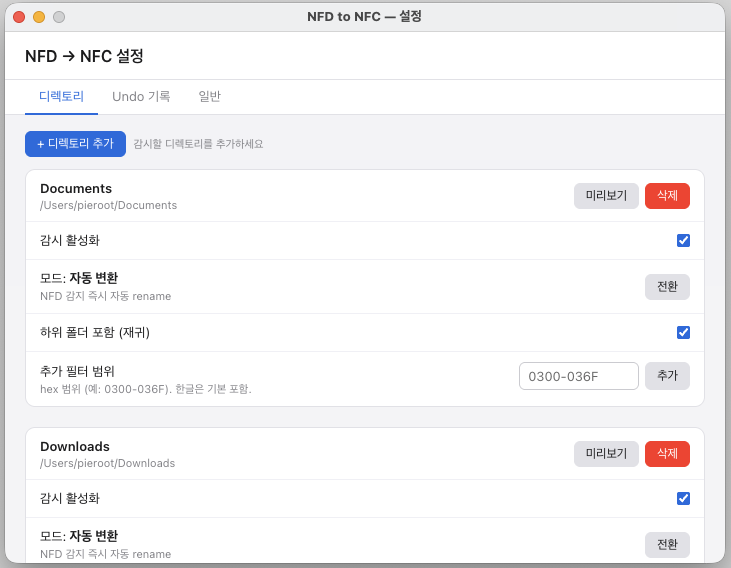
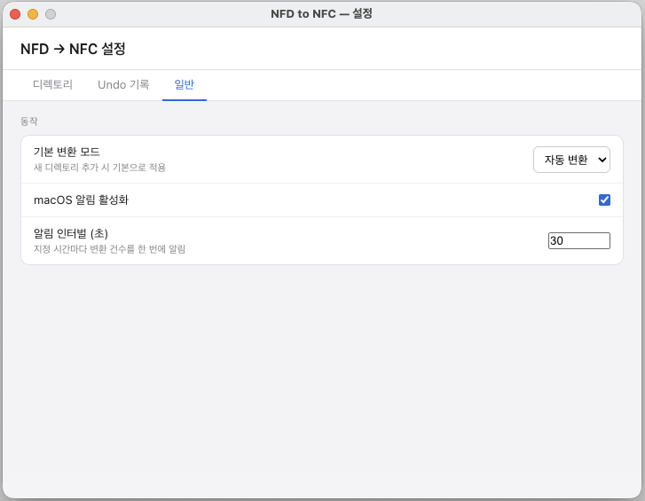

# NFD to NFC Normalizer

macOS에서 한글 파일명이 NFD(자모 분해)로 저장되는 문제를 실시간으로 해결하는 트레이 앱 + CLI + Node.js 라이브러리 통합 패키지입니다.

> **Breaking Change (2.0.0)**: 단일 패키지 구조로 통합됐습니다. `MACOS-APP/`, `nfd2nfc/` 서브 패키지 구조는 제거됐습니다. CLI 명령이 `nfd2nfc file <path>` / `nfd2nfc dir <path>` 형태로 변경됐습니다.

## 주요 기능

- **실시간 감시**: 선택한 디렉토리를 chokidar로 감시하여 파일이 생기는 즉시 NFC로 자동 변환
- **트레이 팝오버**: macOS 메뉴바에 상주, 좌클릭으로 300×400 팝오버 표시
- **설정창**: 3탭 설정 화면 (감시 디렉토리 / Undo 기록 / 일반)
- **Auto / Manual 모드**: Auto는 즉시 변환, Manual은 큐에 누적 후 직접 적용
- **Undo 시스템**: 마지막 5초 배치 또는 개별 변환 되돌리기
- **알림 배치**: 30초 간격으로 변환 건수를 묶어 알림 — 알림 폭주 방지
- **APFS 정확 처리**: 같은 inode 비교로 normalization-insensitive 파일 시스템 올바르게 처리
- **한글 자모 필터**: U+1100-11FF, U+A960-A97F, U+D7B0-D7FF 영역만 대상 (라틴 NFD는 무시)

## 설치

### macOS 애플리케이션

[릴리즈 페이지](https://github.com/jung-geun/NFD2NFC/releases)에서 `NFD2NFC-arm64.dmg` 또는 `NFD2NFC-x64.dmg`를 다운로드하거나 직접 빌드합니다.

### CLI (글로벌 설치)

```bash
npm install -g @pieroot/nfd2nfc
```

### Node.js 라이브러리

```bash
npm install @pieroot/nfd2nfc
```

## 사용법

### macOS 애플리케이션

앱 실행 후 메뉴바 아이콘을 좌클릭하면 팝오버가 표시됩니다. 감시 중인 디렉토리 목록과 최근 활동, Undo 버튼을 한눈에 확인할 수 있습니다.



메뉴바 아이콘을 우클릭하면 감시 일시 정지, 설정창 열기, 종료 메뉴가 나옵니다.



설정창의 **디렉토리** 탭에서 감시할 디렉토리를 추가하고, 디렉토리별로 감시 활성화 여부 / Auto·Manual 모드 / 하위 폴더 포함 / 추가 필터 범위를 개별 설정할 수 있습니다. 추가된 디렉토리는 앱 재시작 시에도 유지됩니다.



**일반** 탭에서는 기본 변환 모드, macOS 알림 활성화, 알림 인터벌(초)을 설정합니다.



### CLI

```bash
# 디렉토리 변환 (재귀)
nfd2nfc dir <path> --recursive

# 미리보기 (실제 변환 없음)
nfd2nfc dir <path> --dry-run

# 단일 파일 변환
nfd2nfc file <path>

# 경로 자동 감지 (파일/디렉토리 판별 후 처리)
nfd2nfc <path>

# 도움말
nfd2nfc --help
```

### Node.js 라이브러리

```javascript
const nfd2nfc = require("@pieroot/nfd2nfc");

// v1 호환 — 단순 문자열 정규화
const nfc = nfd2nfc.normalizeToNFC("NFD로 인코딩된 문자열");
const nfd = nfd2nfc.normalizeToNFD("NFC로 인코딩된 문자열");

// v2 신규 — 파일 시스템 API
const { normalizeEntry, scan, shouldNormalize } = require("@pieroot/nfd2nfc");

// 단일 파일/디렉토리 rename (APFS inode 처리 포함)
const result = await normalizeEntry("/path/to/file", "file");
// result.status: 'renamed' | 'skipped' | 'noop-same-inode' | 'collision'

// 디렉토리 재귀 스캔 (깊이 역순 정렬)
const entries = await scan("/path/to/dir", true);
```

## 빌드

```bash
npm install

# 개발 모드
npm run dev

# 전체 빌드 (앱 + CLI + 라이브러리 + DMG)
npm run build

# 앱만 빌드
npm run build:app

# CLI만 빌드
npm run build:cli
```

## 기여

이 프로젝트에 기여하려면 다음 단계를 따르세요:

1. 이 저장소를 포크합니다.
2. 새로운 브랜치를 만듭니다: `git checkout -b feat/new-feature`
3. 변경 사항을 커밋합니다: `git commit -am 'Add new feature'`
4. 브랜치에 푸시합니다: `git push origin feat/new-feature`
5. PR을 만듭니다.

## 라이선스

이 프로젝트는 MIT 라이선스를 사용합니다.
